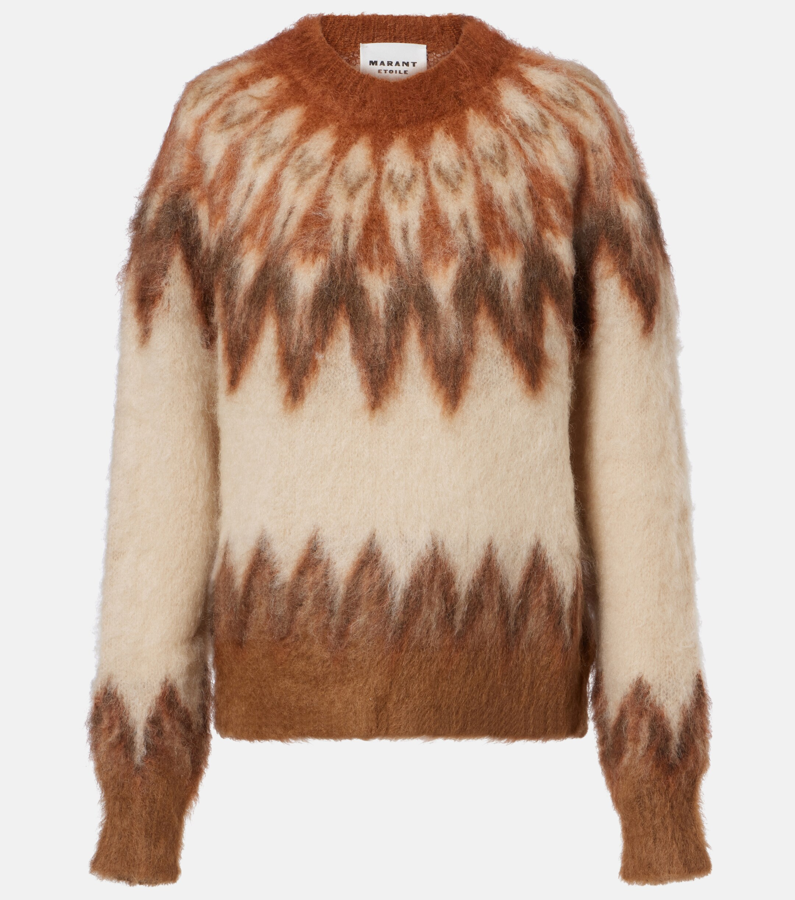
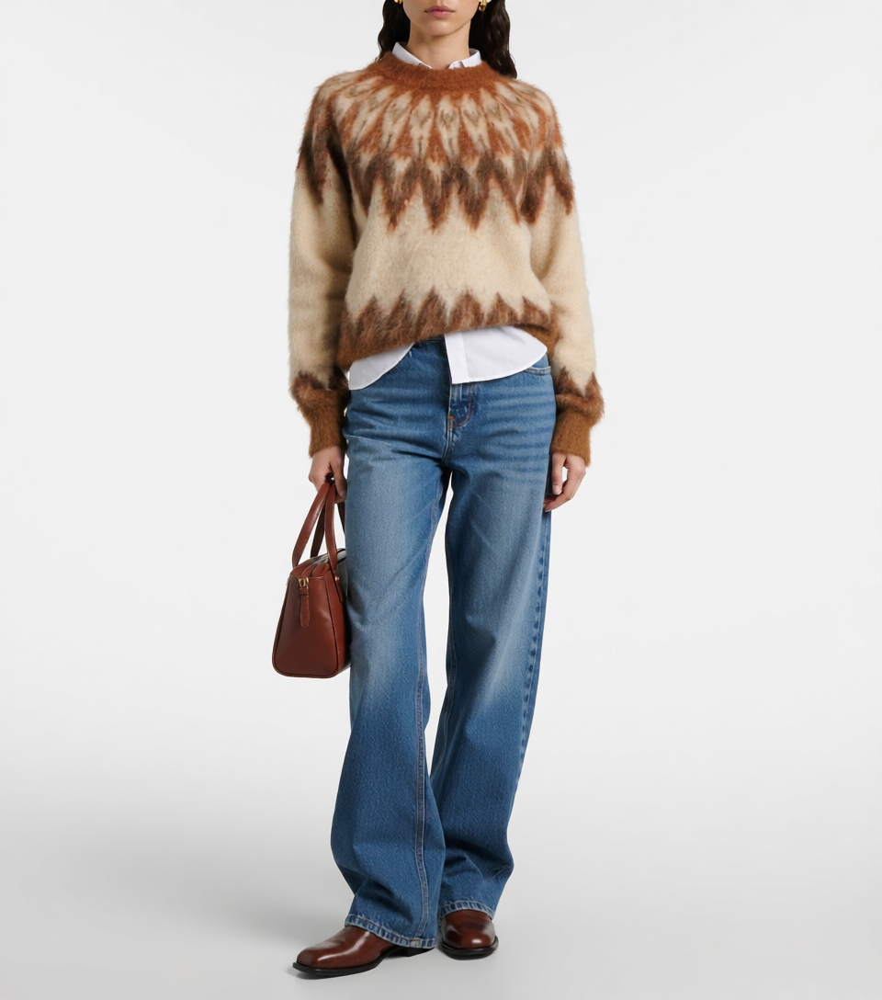
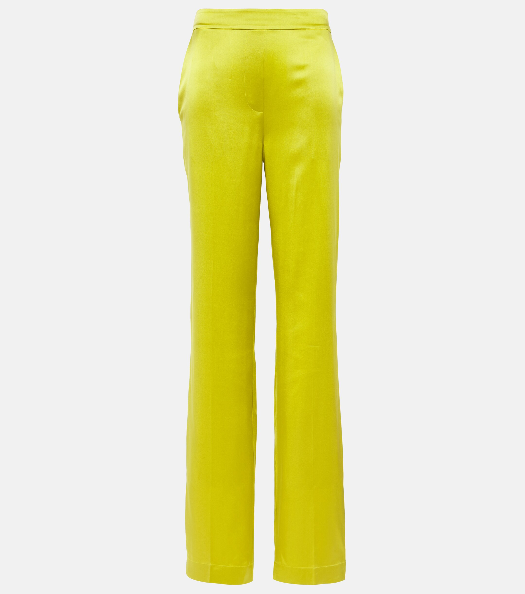
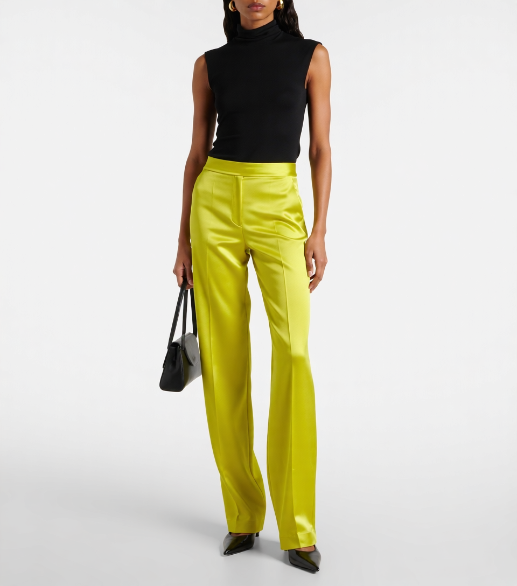
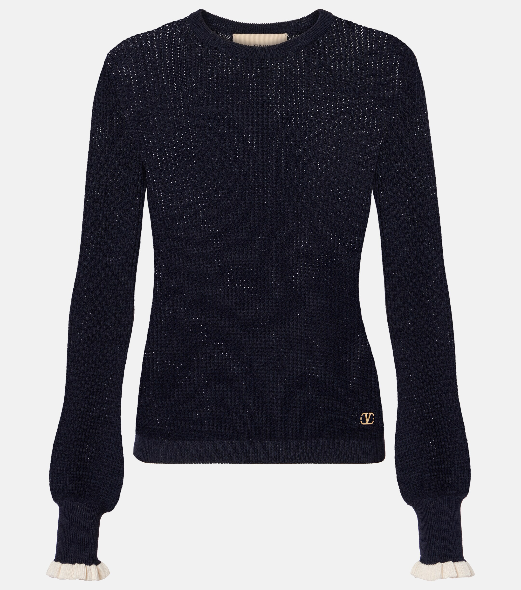
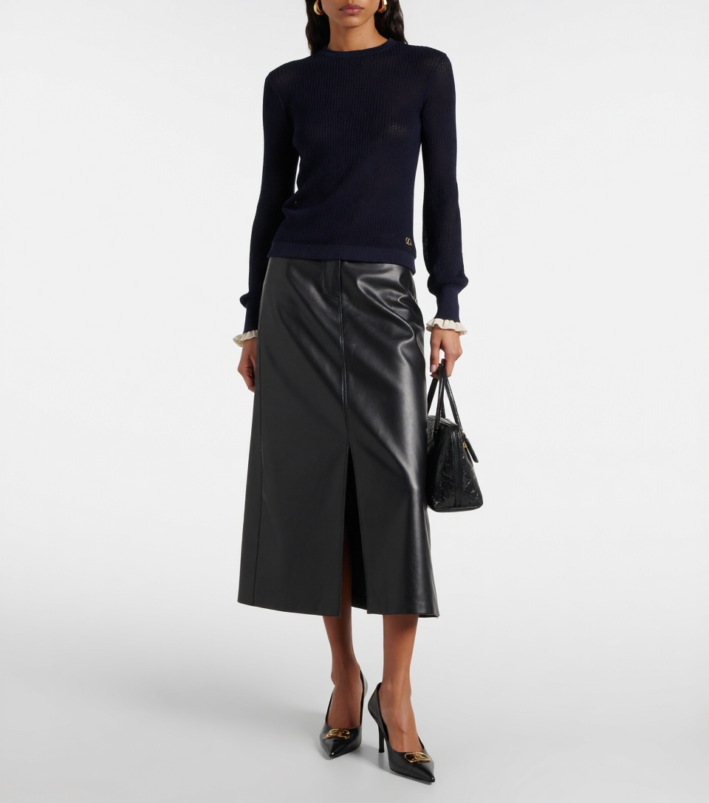

# ENSEMBLE

### An End-to-End Fashion Stylist with Unified Recommendation and Visual Synthesis

> A unified fashion stylist that recommends outfits and generates styled images — all within a single forward pass.

---

## Highlights

- **Unified Recommendation & Generation.** Unlike conventional pipelines that first produce a text description and then feed it to a separate image generator, ENSEMBLE performs outfit recommendation and visual synthesis in one integrated model. The vision-language backbone (Qwen-VL) reasons about style coordination while a diffusion head renders the final look — no intermediate text bottleneck, no information loss.

- **Single-Model Stylist.** Given a single garment image, ENSEMBLE acts as a professional fashion stylist: it analyzes color, silhouette, material, and style context, then both explains its styling rationale and produces a photorealistic image of the complete outfit.

- **Reasoning-Augmented Conditional Generation.** A distinctive property of our architecture is that the Qwen-VL backbone within Qwen-Image-Edit is *not* reduced to a mere text encoder — as is typical of CLIP or T5 in conventional diffusion pipelines. Instead, it retains its full multimodal reasoning capability, functioning simultaneously as a semantic encoder *and* a cognitive reasoning agent. This allows the conditioning signal fed to the diffusion head to carry rich, inference-derived representations — encoding not only surface-level visual attributes but also latent relational reasoning about style compatibility, color harmony, and compositional aesthetics. In other words, the generation process is guided by *understanding*, not merely by *encoding*.

- **End-to-End Training (TODO).** Currently the VLM and diffusion modules are fine-tuned separately with LoRA. Joint end-to-end optimization — allowing gradient flow from diffusion loss back through the VLM — is planned for future work.

## Pretrained Checkpoints

We release the pretrained model weights on Hugging Face:

| Model | Link |
|---|---|
| ENSEMBLE (full pipeline) | [ShineChen1024/ENSEMBLE](https://huggingface.co/ShineChen1024/ENSEMBLE) |

Download via the Hugging Face CLI:

```bash
huggingface-cli download ShineChen1024/ENSEMBLE --local-dir ./checkpoints
```

## Architecture

```
                    ┌─────────────────────────────────────────┐
                    │            ENSEMBLE (Unified)            │
                    │                                          │
  Garment Image ──► │  ┌──────────┐    ┌────────────────────┐  │ ──► Styling Rationale
                    │  │  Qwen-VL  │───►│ Qwen-Image-Edit    │  │ ──► Outfit Image
                    │  │ (LoRA ft) │    │ (LoRA ft)          │  │
                    │  └──────────┘    └────────────────────┘  │
                    │                                          │
                    │  TODO: Joint Training ──────────────────  │
                    └─────────────────────────────────────────┘
```

**Key difference from two-stage approaches:**

| | Two-Stage Pipeline | ENSEMBLE (Ours) |
|---|---|---|
| Recommendation | VLM → text description | VLM → latent representation |
| Generation | Text → diffusion model | Latent → diffusion head |
| Information flow | Lossy (text bottleneck) | Lossless (shared latent space) |
| Inference | Two separate forward passes | Single unified pass |

## How It Works

1. **Input:** A single garment image (e.g., a black cotton top).
2. **Reasoning:** The Qwen-VL backbone analyzes the item's visual attributes — color, shape, material, style — and determines a harmonious outfit composition.
3. **Output:** A natural-language styling rationale explaining *why* the pieces work together, alongside a generated image showing the complete styled look.

## Examples

Given a single garment image, ENSEMBLE recommends a complete outfit and generates the styled look:

### Fair Isle Cashmere Sweater
| Input | Output |
|:---:|:---:|
|  |  |

> **Rationale:** The brown Fair Isle cashmere sweater layered over a white inner, paired with blue high-waisted straight-leg jeans, makes the vintage feel more wearable. The patterned, warm upper body contrasts with the clean, straight-falling lower half — comfortable for autumn/winter weekends or travel.

### Black & White Striped Polo
| Input | Output |
|:---:|:---:|
|  |  |

> **Rationale:** The black-and-white striped collared top pairs well with blue high-waisted wide-leg jeans — a classic casual combination that stays timeless. The striped top keeps the upper body fresh, while the wide-leg pants relax the lower half. Both pieces are classics that look effortlessly put-together.

### Yellow Satin Trousers
| Input | Output |
|:---:|:---:|
|  |  |

> **Rationale:** These yellow satin straight-leg trousers have a bold, vivid color — a black sleeveless turtleneck grounds the brightness. The black-yellow contrast is sharp, the trouser silhouette stays clean enough, and the overall look conveys confidence and presence for an evening out.

### Navy Wool-Cashmere Sweater
| Input | Output |
|:---:|:---:|
|  |  |

> **Rationale:** The blue wool-cashmere sweater paired with a black leather midi skirt creates a clear contrast between soft and structured. The blue keeps the black skirt from feeling too harsh, while the midi length preserves a mature look — polished enough for autumn commuting or evening gatherings.

## Training

ENSEMBLE adopts a three-stage training strategy:

- **Stage 1 — VLM Fine-tuning:** Qwen2.5-VL-7B is fine-tuned with LoRA on curated outfit recommendation data, learning to reason about garment compatibility and produce styling rationales.
- **Stage 2 — Diffusion Fine-tuning:** [Qwen-Image-Edit](https://github.com/QwenLM/Qwen-Image-Edit) is fine-tuned with LoRA, conditioned on the VLM's hidden-state representations rather than on generated text descriptions.
- **Stage 3 — Joint Optimization (TODO):** End-to-end co-training of VLM and diffusion modules in a single training loop, enabling gradient flow from the diffusion loss back through the VLM backbone.

## Project Structure

```
ENSEMBLE/
├── inference.py              # Single-image CLI inference
├── app.py                    # Gradio web UI
├── merge_lora_vlm.py         # Merge LoRA into Qwen2.5-VL
├── merge_lora_diffusion.py   # Merge LoRA into Qwen-Image-Edit
├── scripts/                  # Shell launch scripts
├── requirements.txt
└── README.md
```

## Citation

If you find this work useful, please cite:

```bibtex
@article{ensemble2026,
    title={ENSEMBLE: An End-to-End Fashion Stylist with Unified Recommendation and Visual Synthesis},
    author={},
    year={2026}
}
```

## Acknowledgments

This project builds upon [Qwen2.5-VL](https://github.com/QwenLM/Qwen2.5-VL) and [Qwen-Image-Edit](https://github.com/QwenLM/Qwen-Image-Edit). The outfit dataset is based on [Garments2Look](https://arxiv.org/abs/2603.14153).
