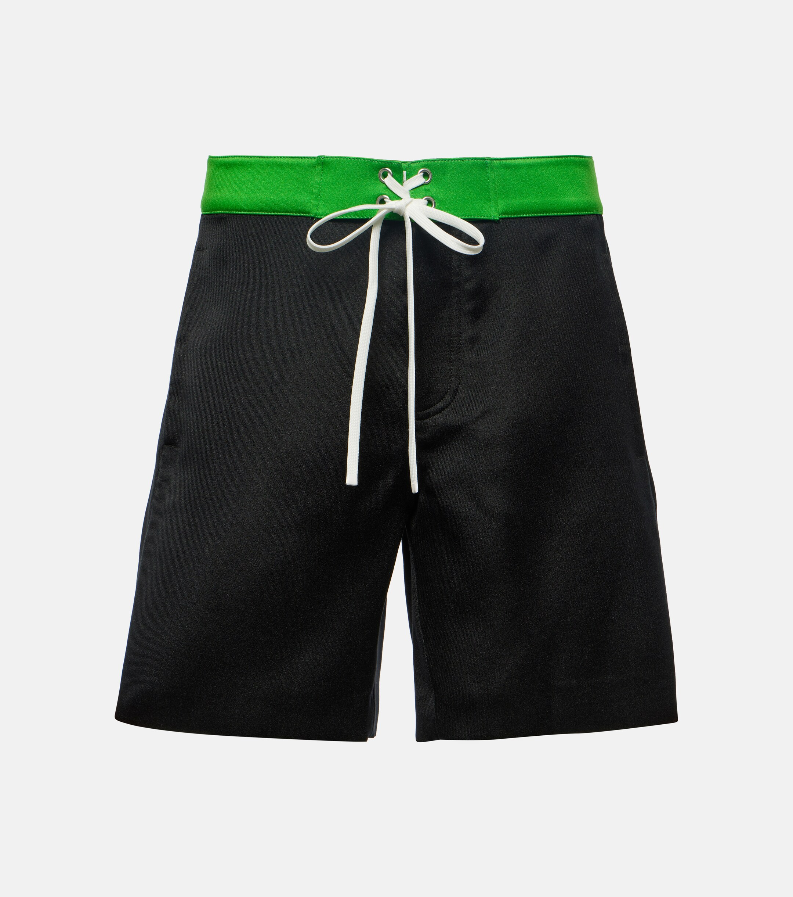
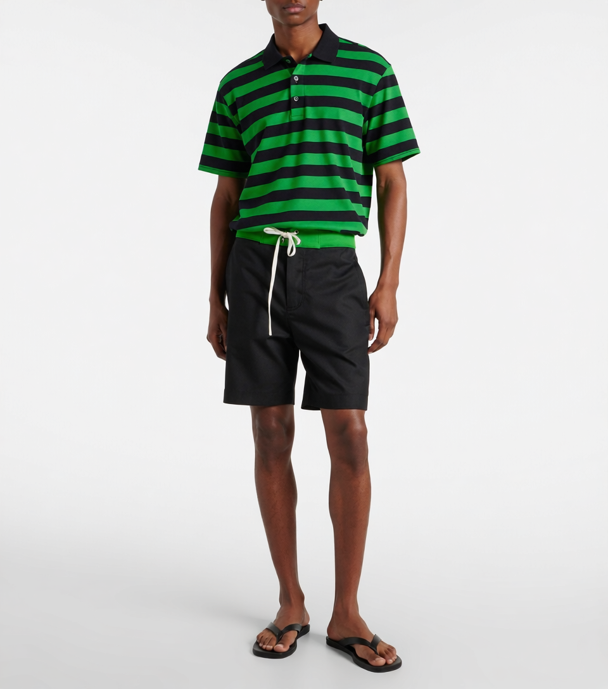
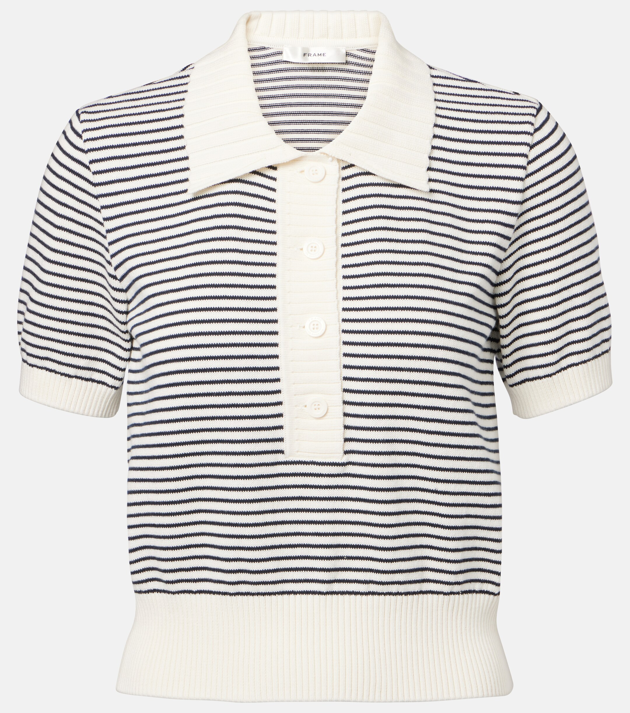
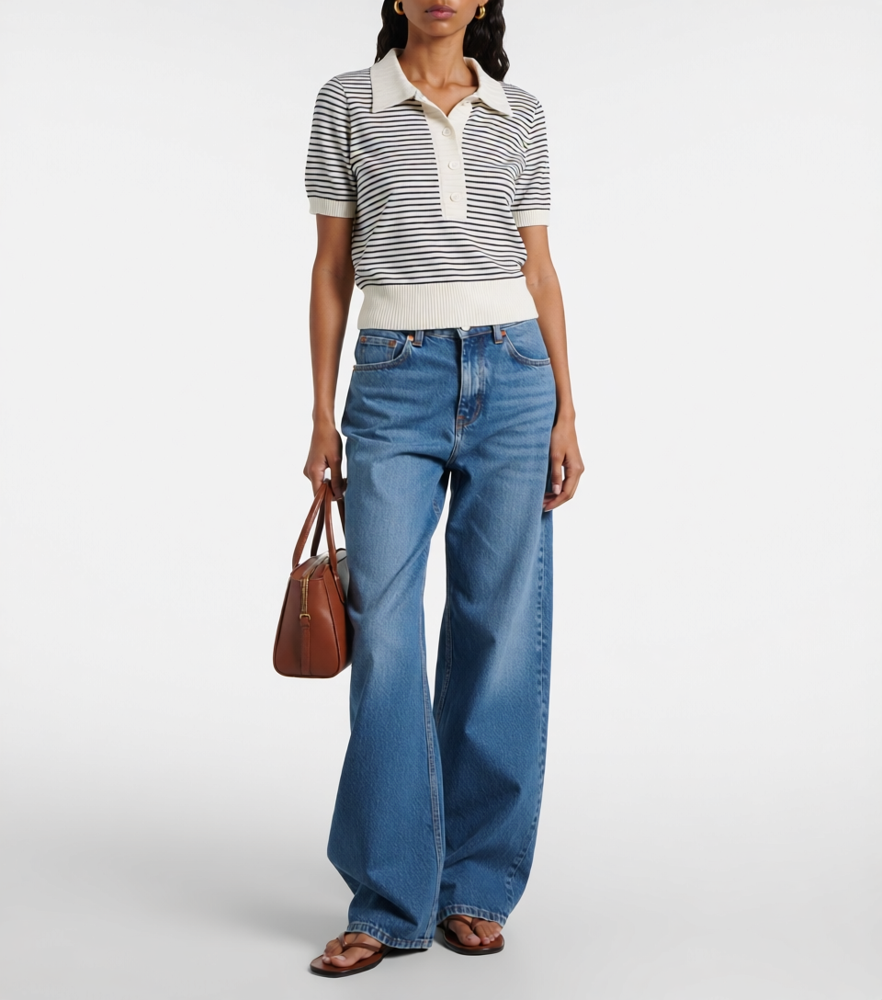
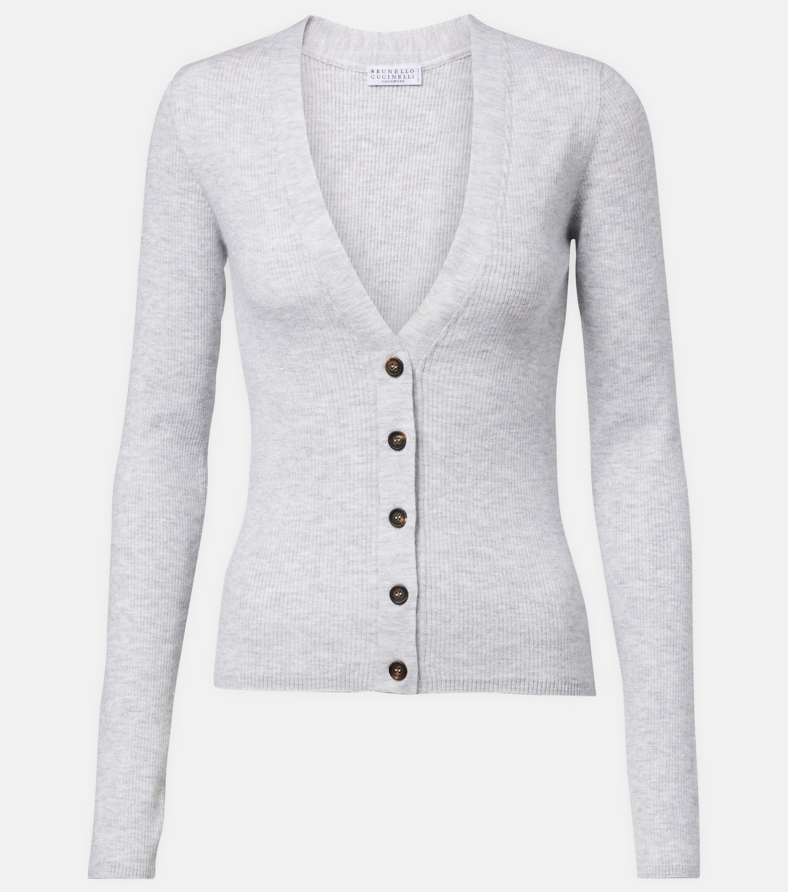
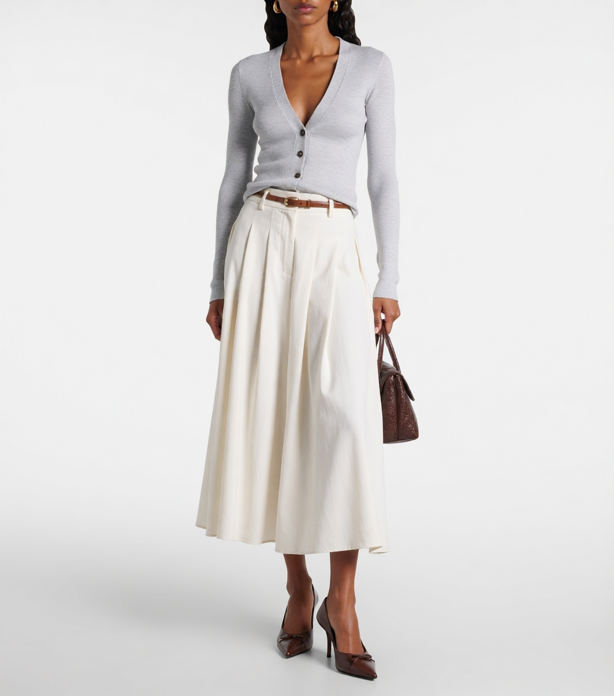
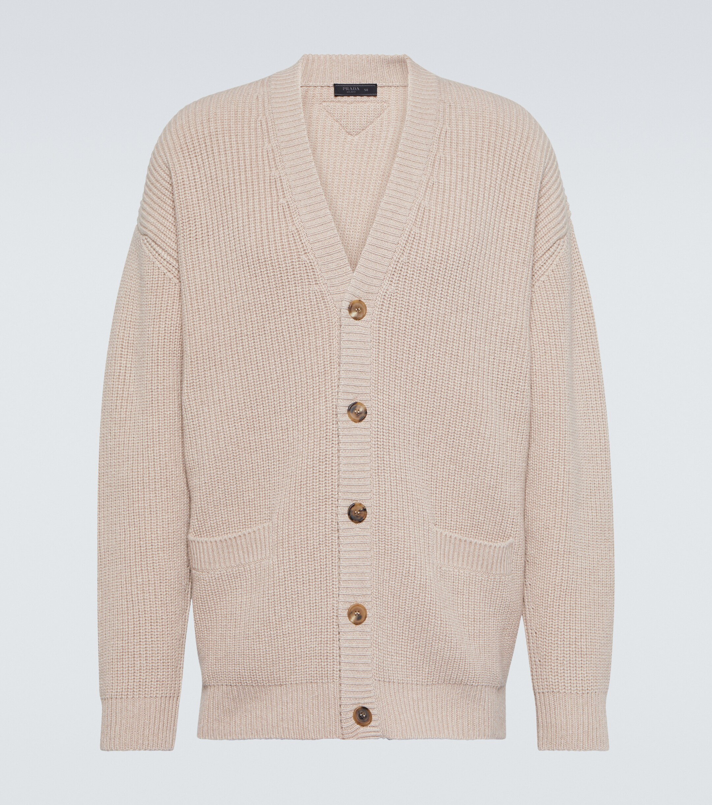
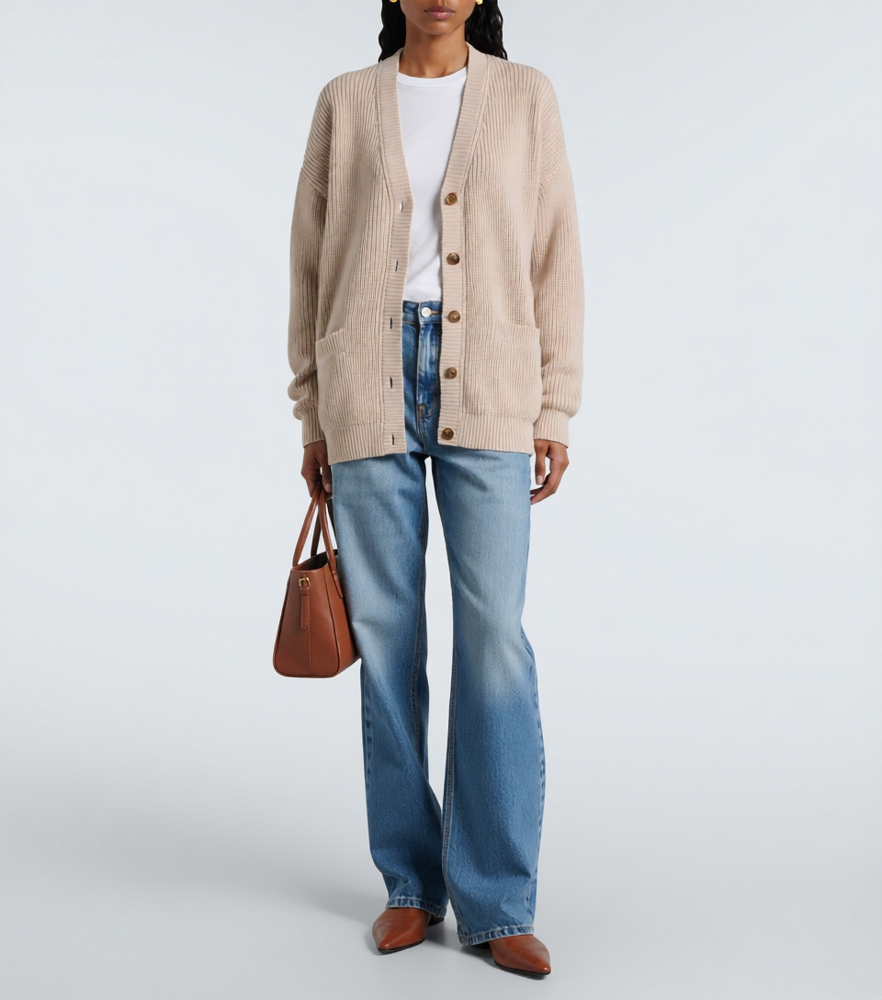

# ENSEMBLE

### See, Understand, and Style: Reasoning-Augmented Unified Fashion Recommendation and Visual Synthesis

> A unified fashion stylist that recommends outfits and generates styled images — all within a single forward pass.

---

## Highlights

- **Unified Recommendation & Generation.** Unlike conventional pipelines that first produce a text description and then feed it to a separate image generator, ENSEMBLE performs outfit recommendation and visual synthesis in one integrated model. The vision-language backbone (Qwen-VL) reasons about style coordination while a diffusion head renders the final look — no intermediate text bottleneck, no information loss.

- **Single-Model Stylist.** Given a single garment image, ENSEMBLE acts as a professional fashion stylist: it analyzes color, silhouette, material, and style context, then both explains its styling rationale and produces a photorealistic image of the complete outfit.

- **Reasoning-Augmented Conditional Generation.** A distinctive property of our architecture is that the Qwen-VL backbone within Qwen-Image-Edit is *not* reduced to a mere text encoder. Instead, it retains its full multimodal reasoning capability, functioning simultaneously as a semantic encoder *and* a cognitive reasoning agent. This allows the conditioning signal fed to the diffusion head to carry rich, inference-derived representations — encoding not only surface-level visual attributes but also latent relational reasoning about style compatibility, color harmony, and compositional aesthetics. In other words, the generation process is guided by *understanding*, not merely by *encoding*.

- **End-to-End Training (TODO).** Currently the VLM and diffusion modules are fine-tuned separately with LoRA. Joint end-to-end optimization — allowing gradient flow from diffusion loss back through the VLM — is planned for future work.

## Pretrained Checkpoints

We release the pretrained model weights on Hugging Face:

| Model | Link |
|---|---|
| ENSEMBLE (full pipeline) | [ShineChen1024/ENSEMBLE](https://huggingface.co/ShineChen1024/ENSEMBLE) |

Download via the Hugging Face CLI:

```bash
huggingface-cli download ShineChen1024/ENSEMBLE --local-dir ./checkpoints
```

## Architecture

```
                    ┌─────────────────────────────────────────┐
                    │            ENSEMBLE (Unified)            │
                    │                                          │
  Garment Image ──► │  ┌──────────┐    ┌────────────────────┐  │ ──► Styling Rationale
                    │  │  Qwen-VL  │───►│ Qwen-Image-Edit    │  │ ──► Outfit Image
                    │  │ (LoRA ft) │    │ (LoRA ft)          │  │
                    │  └──────────┘    └────────────────────┘  │
                    │                                          │
                    │  TODO: Joint Training ──────────────────  │
                    └─────────────────────────────────────────┘
```

**Key difference from two-stage approaches:**

| | Two-Stage Pipeline | ENSEMBLE (Ours) |
|---|---|---|
| Recommendation | VLM → text description | VLM → latent representation |
| Generation | Text → diffusion model | Latent → diffusion head |
| Information flow | Lossy (text bottleneck) | Lossless (shared latent space) |
| Inference | Two separate forward passes | Single unified pass |

## How It Works

1. **Input:** A single garment image (e.g., a black cotton top).
2. **Reasoning:** The Qwen-VL backbone analyzes the item's visual attributes — color, shape, material, style — and determines a harmonious outfit composition.
3. **Output:** A natural-language styling rationale explaining *why* the pieces work together, alongside a generated image showing the complete styled look.

## Examples

Given a single garment image, ENSEMBLE recommends a complete outfit and generates the styled look:

### Black Bermuda Shorts
| Input | Output |
|:---:|:---:|
|  |  |

> **Rationale:** 这条黑色棉质百慕大短裤配绿色条纹棉混翻领上衣，颜色有活力但不乱。短裤保留轻松感，条纹上身带出节奏，夏日休闲穿起来年轻又清爽。

### Black & White Striped Polo
| Input | Output |
|:---:|:---:|
|  |  |

> **Rationale:** 黑白条纹翻领上衣适合配蓝色高腰阔腿牛仔裤，经典休闲会很耐看。条纹上身保持清爽，宽裤放松下身，日常穿很有精神。条纹翻领和高腰阔腿裤都很经典，放在一起很耐看。

### Grey Ribbed Wool Cardigan
| Input | Output |
|:---:|:---:|
|  |  |

> **Rationale:** 灰色罗纹羊毛开衫适合配白色棉质中长裙，因为上身有柔软纹理，下身要保持清爽。让灰白关系显得安静，也带一点通勤感。适合白天会面或轻松办公，温和但不松散。

### Beige Wool-Cashmere Cardigan
| Input | Output |
|:---:|:---:|
|  |  |

> **Rationale:** 米色羊毛羊绒开衫叠白色棉质短袖，再配蓝色高腰直筒牛仔裤，是很耐看的秋季日常组合。开衫柔软，白色内层让上身更清爽，牛仔裤把整体拉回轻松状态。它适合白天出行或周末会面，温和、干净，也有层次。

## Training

ENSEMBLE adopts a three-stage training strategy:

- **Stage 1 — VLM Fine-tuning:** Qwen2.5-VL-7B is fine-tuned with LoRA on curated outfit recommendation data, learning to reason about garment compatibility and produce styling rationales.
- **Stage 2 — Diffusion Fine-tuning:** [Qwen-Image-Edit](https://github.com/QwenLM/Qwen-Image-Edit) is fine-tuned with LoRA, conditioned on the VLM's hidden-state representations rather than on generated text descriptions.
- **Stage 3 — Joint Optimization (TODO):** End-to-end co-training of VLM and diffusion modules in a single training loop, enabling gradient flow from the diffusion loss back through the VLM backbone.

## Project Structure

```
ENSEMBLE/
├── inference.py              # Single-image CLI inference
├── app.py                    # Gradio web UI
├── merge_lora_vlm.py         # Merge LoRA into Qwen2.5-VL
├── merge_lora_diffusion.py   # Merge LoRA into Qwen-Image-Edit
├── scripts/                  # Shell launch scripts
├── requirements.txt
└── README.md
```

## Citation

If you find this work useful, please cite:

```bibtex
@article{ensemble2026,
    title={ENSEMBLE: An End-to-End Fashion Stylist with Unified Recommendation and Visual Synthesis},
    author={},
    year={2026}
}
```

## Acknowledgments

This project builds upon [Qwen-Image-Edit](https://huggingface.co/Qwen/Qwen-Image-Edit-2511).
